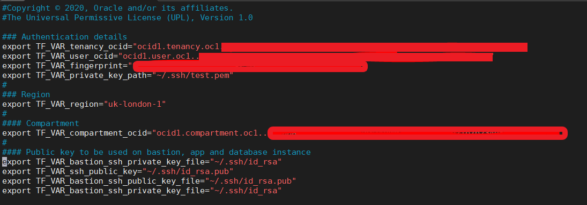

# Disaster Recovery

Disaster Recovery Network and connectivity setup
=======================================================

This solution provides a Network Architecture deployment to demonstrate Disaster Recovery scenario across 2 regions [ examples are geared towards region Ashburn & Phoenix and can be used for any OCI regions].


## Quickstart Deployment

1. Clone this repository to your local host. The `pilot-light` directory contains the Terraform configurations for a sample topology based on the architecture described earlier.
    ```
    $ git clone https://orahub.oci.oraclecorp.com/oci-ocbd-custom-app/disaster-recovery.git
    $ cd disaster-recovery/pilot-light
    ```

2. Install Terraform. See https://learn.hashicorp.com/terraform/getting-started/install.html.

3. Setup tenancy values for terraform variables by updating **env-vars** file with the required information. The file contains definitions of environment variables for your Oracle Cloud Infrastructure tenancy.
    The following example is using London as the primary region.
    
    
   ```
    $ source env-vars
    ```
    
4. Create **terraform.tfvars** from *terraform.tfvars.sample* file with the inputs for the architecture that you want to build. A running sample terraform.tfvars file is available below. The contents of sample file can be copied to create a running terraform.tfvars input file. Update db_admin_password with actual password in terraform.tfvars file.

    
    
5. Deploy the topology:

-   **Deploy Using Terraform**
    
    ```
    $ terraform init
    $ terraform plan
    $ terraform apply
    ```
    When you’re prompted to confirm the action, enter yes.

    When all components have been created, Terraform displays a completion message. For example: Apply complete! Resources: nn added, 0 changed, 0 destroyed.

6. If you want to delete the infrastructure, run:
    First navigate to OCI Console and terminate the Standby database and once the termination is successfull then run the following command
    ```
    $ terraform destroy
    ```
    When you’re prompted to confirm the action, enter yes.


## Inputs required in the terraform.tfvars file
*Sample terraform.tfvars file to create Hyperion infrastructure in single availability domain architecture*

```
# DR region for standby (us-phoenix-1, ap-seoul-1, ap-tokyo-1, ca-toronto-1)
dr_region = "us-phoenix-1"

# CIDR block of Standby VCN to be created
dr_vcn_cidr_block = "10.0.0.0/16"

# CIDR block of Primary VCN to be created
vcn_cidr_block = "192.168.0.0/16"

# DNS label of VCN to be created
vcn_dns_label = "drvcn"

# Object Storage bucker name (will be prefixed by region name)
bucket_display_name = "bucket-dr"

# Compute shape for bastion server
bastion_server_shape = "VM.Standard2.1"

# Compute shape for application servers
app_server_shape = "VM.Standard2.2"

# Database display name
db_display_name = "ActiveDBSystem"

# Compute shape for Database server
db_system_shape = "VM.Standard2.2"

# DB admin password for database
db_admin_password = "AAbb__111"

# shape for Load Balancer
lb_shape = "100Mbps"

# Cron schedule for Primary region [this runs every 12 hours]
cron_schedule = "0 */12 * * *"

# Cron schedule for Standby region, this is intentionally commented out as the replication job should run only on servers in primary regio [runs every 12 hours]
dr_cron_schedule = "#0 */12 * * *"

# path to public ssh key to set as the authorized key on the bastion host
bastion_ssh_public_key_file  = "~/.ssh/id_rsa.pub"

# path to private ssh key to access the bastion host
bastion_ssh_private_key_file = "~/.ssh/id_rsa"

# path to public ssh key to set as the authorized key for all app instances 
remote_ssh_public_key_file   = "~/.ssh/id_rsa.pub"

# path to private ssh key for all app instances
remote_ssh_private_key_file  = "~/.ssh/id_rsa"
```
## Example of the results terraform will produce.
 *Example: Instances in the Primary Region*

 .PNG)
 
 *Example: Database system in the Primary Region*

 .PNG)
 
 *Example: Instance in the Secondary Region*

 .PNG)
 
 *Example: Database system in the Secondary Region*

 .PNG)
 
## Configurations the DNS for failover.

## Troubleshooting


### End
