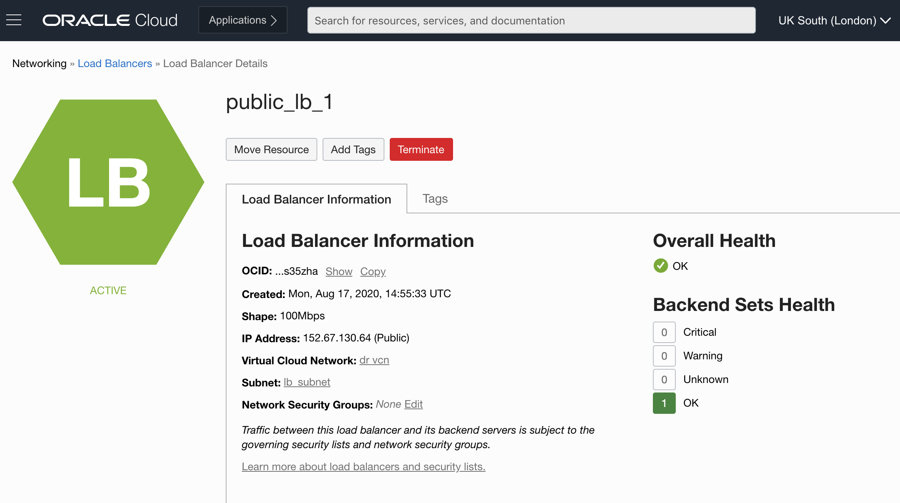
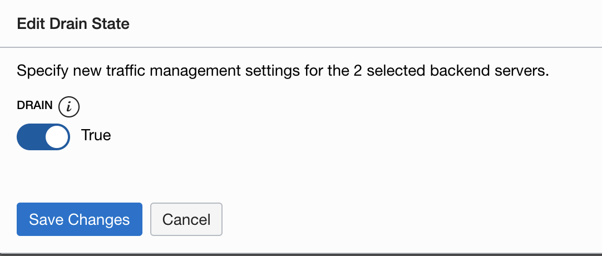
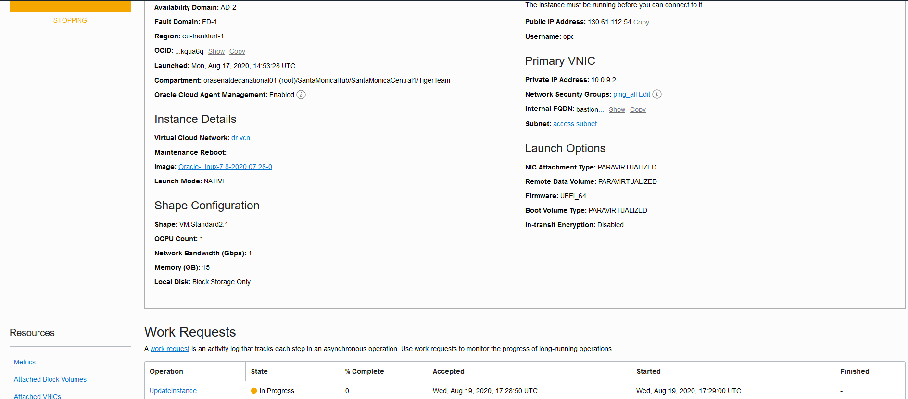
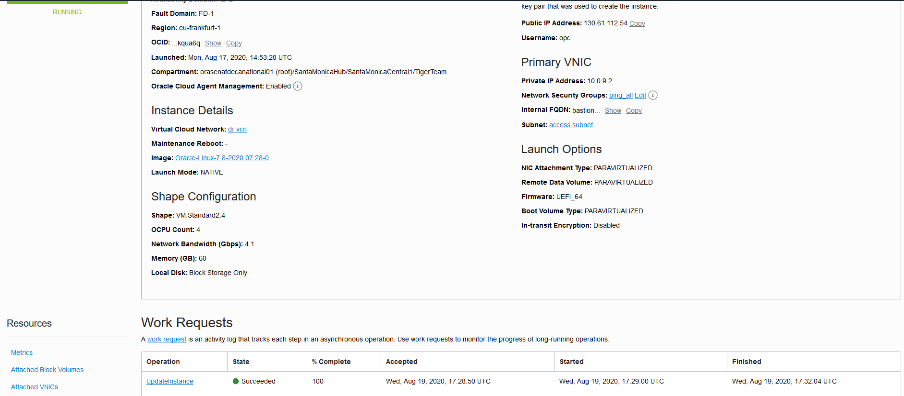

# Lab 300: Simulate Disaster
<!-- Comment out table of contents
## Table of Contents
[Introduction](#introduction)
-->

## Introduction

*In addition to the workshop*, feel free to watch the walk-through companion video by clicking on the following link:
[Lab 300 Walkthrough Video]()

### Objectives
- Drain connections in Primary load balancer
- Show DNS failover to standby region
- Scale up compute node in standby region

### Extra Resources
-   To learn more about Load Balancer, feel free to explore the capabilities by clicking on this link: [Load Balancer Documentation](https://docs.cloud.oracle.com/en-us/iaas/Content/Balance/Concepts/balanceoverview.htm)
-   To learn more about , how the OCI API scales up the compute node, here is the relevant [documentation](https://docs.cloud.oracle.com/en-us/iaas/api/#/en/iaas/20160918/datatypes/UpdateInstanceDetails).

## Part 1. The Disaster

### Drain connections from Primary Region Load Balancer

Navigate from the upper left hamburger menu to networking -> Load balancers. Find the Load Balancer in your primary region.

Go to your backend set. 

Check mark your backends. Then press actions.

Set the drain state to True. This will stop all current connections and simulate the disaster. 

Your health check on your primary region is now failing, and traffic hitting your DNS should now be routed to your standby region. 

If you installed the HTML to your standby server, you should now see this. You can see our DNS entry - 'oci.life' with the subdomain 'alexmcdonald'.

If you navigate to health/check traffic steering - you can see the health for the Primary region load balancer is now critical. If you visit the IP address of this load balancer, you will get 502 bad gateway. 

Now, enter your DNS url in your web browswer, you should see the HTML indicating you are now seeing traffic steered to your standby region. 

## Part 2. Scaling the standby region compute node

### **STEP 1**: Configure SDK

Please follow steps in [lab200](https://github.com/arshyasharifian/DR_DNS/blob/master/LabGuide200.md) to configure the SDK for your python scripts to call resources in your tenancy.

### **STEP 2**: Run Python scripts

This [link](https://docs.cloud.oracle.com/en-us/iaas/Content/API/Concepts/apisigningkey.htm#Required_Keys_and_OCIDs) will help you setup the rest api key that python needs to run scaling script.

*The script will not continue unitl the scaling is complete. Check the OCI console work request to see when the instance will be available again.*

*The instance will be shutdown while the update takes place.*

*You can now log into the instance again*

## Summary

-   In this lab, you learned how to simulate a disaster event, and redirect traffic to your standby region.

-   **You are ready to move on to the next lab!**

[Back to top](#introduction)

